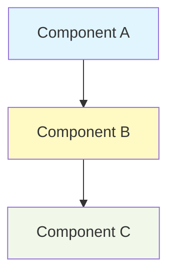
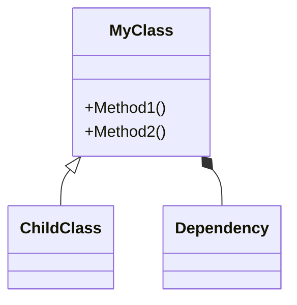
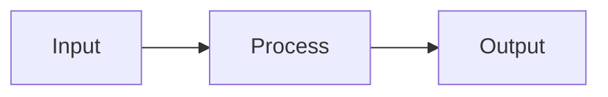

# Code Study Roadmap

## Overview

Create a **progressive study roadmap** that guides users from high-level understanding to deep implementation details. The roadmap grows in complexity: concepts → usage → internals → mastery.

**Core principle:** Study roadmaps are **learning journeys**, not reference documentation. Include Mermaid diagrams for visual understanding.

## When to Use

```
User asks: "How do I study this codebase?"
User says: "Help me understand [library/subsystem]"
User wants: A learning path for source code
```

**Use this skill when:**
- User wants to understand a library, framework, or subsystem
- User asks "how should I study this code"
- User needs a structured approach to exploring new code
- User wants to know what makes code perform well

**Do NOT use for:**
- Quick API reference (use official docs)
- Single function explanations (explain directly)
- Code reviews (use code-review skills)

## Core Pattern

The roadmap MUST follow this **growing order**:

### Level 1: Overall Ideas (The "Why")
```markdown
## 1. Overall Ideas

### What Problem Does It Solve?
- [Describe the problem this code solves]

### Pros and Cons
**Pros:**
- [Advantage 1]
- [Advantage 2]

**Cons/Limitations:**
- [Limitation 1]
- [When not to use]

### When to Use This Library
- [Use case 1]
- [Use case 2]
```

### Level 2: API Usage (The "How")
```markdown
## 2. API Usage

### Basic Usage
[Code examples showing primary use cases]

### Common Patterns
[Typical usage patterns]

### Quick Reference Table
| Function/Class | Purpose | Example |
|---------------|---------|---------|
```

### Level 3: Implementation Details (The "Deep Dive")
```markdown
## 3. Implementation Details

### Performance Techniques
- [What makes it fast]
- [Design patterns used]
- [Memory optimizations]

### Architecture Overview
[Include Mermaid diagram showing structure]

### Key Algorithms
[Important algorithms with complexity analysis]
```

### Level 4: Concrete Quizzes (The "Test")
```markdown
## 4. Test Your Understanding

### Quiz Level 1: Basics
1. [Question testing basic understanding]
2. [Question testing basic understanding]

### Quiz Level 2: Intermediate
1. [Question requiring deeper knowledge]
2. [Question requiring deeper knowledge]

### Quiz Level 3: Advanced
1. [Design/analysis question]
2. [Performance question]

### Practical Exercises
1. [Exercise to implement something]
2. [Exercise to modify/optimize code]
```

## Quick Reference

| Section | Purpose | Key Content |
|---------|---------|-------------|
| **1. Overall Ideas** | Build mental model | Problem, pros/cons, when to use |
| **2. API Usage** | Learn to use it | Code examples, patterns, reference table |
| **3. Implementation** | Understand internals | Performance techniques, architecture diagrams |
| **4. Quizzes** | Verify understanding | Progressive questions, practical exercises |

**Visual aids required:**
- Architecture diagram (Mermaid `graph` or `flowchart`)
- Component relationships (Mermaid `classDiagram` or `graph`)
- Data flow (Mermaid `flowchart LR`)

### Adapting Depth to Code Size

**Always follow the 4-level structure.** Adjust depth, not structure:

| Code Size | Strategy | Example |
|-----------|----------|---------|
| **Small** (< 5 files) | Keep sections brief, focus on patterns | Single function with clever technique |
| **Medium** (5-20 files) | Standard depth, cover major components | Typical library or module |
| **Large** (> 20 files) | Break into subsystems, create sub-roadmaps | absl::strings, entire framework |

**For small code:**
- Level 1: What problem does it solve? (2-3 sentences)
- Level 2: 2-3 key usage examples
- Level 3: Main technique/pattern used (even if not "performance")
- Level 4: 2-3 quiz questions testing understanding

**For large code:**
- Create high-level roadmap first
- Add "Suggested Sub-Roadmaps" section for major subsystems
- Focus on architecture and relationships between components

## Implementation

### Mermaid Diagrams to Include

**1. Architecture Overview (graph or flowchart):**


**2. Class/Module Relationships (classDiagram):**


**3. Data Flow/Process (flowchart LR):**


### Study Questions to Ask

**For Level 1 (Ideas):**
- What problem does this solve?
- Why does this exist?
- What are alternatives (and why choose this)?
- When should you NOT use this?

**For Level 2 (API):**
- What are the most common operations?
- What are the gotchas?
- How do I compose operations?
- What's the typical workflow?

**For Level 3 (Implementation):**
- What performance techniques are used?
- What design patterns?
- What are the key data structures?
- What trade-offs were made?

**For Level 4 (Quizzes):**
- Can the user explain what it does?
- Can they predict performance characteristics?
- Can they choose between alternatives?
- Can they extend/modify it?

## Common Mistakes

| Mistake | Why Bad | Fix |
|---------|---------|-----|
| **Creating reference docs** | Not a learning path | Follow growing order: ideas → API → internals → quizzes |
| **No diagrams** | Hard to visualize structure | Include Mermaid diagrams for architecture |
| **Missing pros/cons** | No critical thinking | Always include "pros and cons" section |
| **No performance focus** | Missing key insight | Explain what makes it fast/slow |
| **Quizzes too easy** | Don't test understanding | Include progressive difficulty (basic → advanced) |
| **Too much detail early** | Overwhelms learner | Start high-level, add detail progressively |
| **No practical exercises** | Passive learning | Include hands-on exercises, leave out critical sections for user to implement |
| **Just listing files** | Not a study path | Explain WHY files matter and ORDER to read them |

## Rationalizations to Avoid

| Excuse | Reality | Action |
|--------|---------|--------|
| "This code is too simple for a roadmap" | Even simple code benefits from structured learning | Still follow the 4-level structure, adjust depth accordingly |
| "There are no performance techniques" | All code has trade-offs and design choices | Discuss complexity, memory usage, or design patterns instead |
| "User just wants a quick overview" | Quick overview ≠ comprehensive study | Provide overview in Level 1, but complete all 4 levels |
| "This is a reference, not a library" | All code can be studied systematically | Focus on concepts, patterns, and design decisions |
| "Diagrams aren't necessary for this code" | Visuals always help understanding | Even simple diagrams show structure and relationships |
| "Quizzes feel artificial here" | Testing understanding is always valuable | Adapt quiz style to the code (analysis, prediction, extension) |

**All of these mean: Follow the skill structure anyway. Adjust depth, not structure.**

## Example Structure

```markdown
# Code Study Roadmap: [Library Name]

## 1. Overall Ideas

### What Problem Does It Solve?
[1-2 sentences explaining the core problem]

### Pros and Cons
**Pros:**
- [Advantage]
- [Advantage]

**Cons:**
- [Limitation]
- [When not to use]

### Architecture Overview
[Mermaid diagram showing high-level structure]

## 2. API Usage

### Basic Usage Example
```cpp
[Most common use case]
```

### Common Patterns
1. [Pattern 1 with example]
2. [Pattern 2 with example]

### Quick Reference
| Function | Purpose | Example |
|----------|---------|---------|

## 3. Implementation Details

### Performance Techniques
- [Technique 1]: [Explanation]
- [Technique 2]: [Explanation]

### Key Design Patterns
- [Pattern]: [How it's used]
- [Pattern]: [How it's used]

### Component Structure
[Mermaid classDiagram or detailed graph]

## 4. Test Your Understanding

### Level 1: Basics (Can you use it?)
1. [Question]
2. [Question]

### Level 2: Intermediate (Do you understand it?)
1. [Question]
2. [Question]

### Level 3: Advanced (Can you analyze it?)
1. [Question]
2. [Question]

### Practical Exercises
1. [Exercise]
2. [Exercise]

## 5. Suggested Reading Order
1. [File/Concept] - [Why first]
2. [File/Concept] - [Why next]
3. [File/Concept] - [Why last]
```

## Real-World Impact

**Without this skill:**
- Users get reference documentation
- No progressive learning path
- Missing visual diagrams
- No way to test understanding

**With this skill:**
- Structured journey from concepts to mastery
- Visual architecture understanding
- Self-testing through quizzes
- Clear reading order for source code
